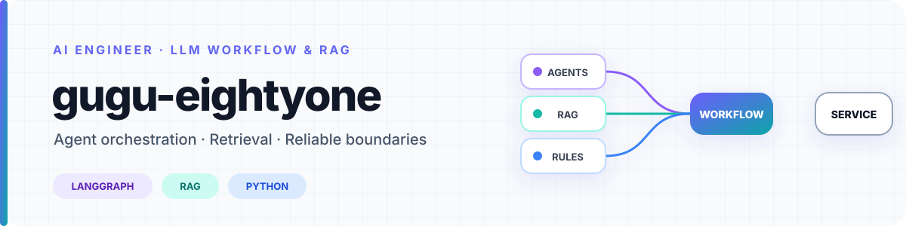

<picture>
  <source media="(prefers-color-scheme: dark)" srcset="./profile-assets/banner-dark.svg">
  <source media="(prefers-color-scheme: light)" srcset="./profile-assets/banner-light.svg">
  
</picture>

 
<strong>LLM의 자율성을 살리면서도, 서비스의 규칙 안에서 작동하도록 설계합니다.</strong>

## What I Care About

여러 에이전트의 역할을 나누고, RAG로 필요한 근거를 제공하며, 검증 로직으로 결과를 점검하는 LLM 워크플로우에 관심이 있습니다.

## Toolbox

| Level | Tools |
|---|---|
| **Main Stack** | Python, LangGraph, RAG, OpenAI API |
| **Hands-on Experience** | FastAPI, Django, Qdrant, MySQL, Docker, AWS EC2 |
| **Additional** | Streamlit, pytest, Git, HTML, CSS, JavaScript |

## Featured Projects

### 01 · [w.LiGHTER](https://github.com/gugu-eightyone/w-lighter_model-server)

한국 웹소설을 영어·일본어·중국어·태국어로 번역하고 현지화를 지원하는 SaaS입니다.  
3인으로 구성된 AI 모델 팀에서 **번역 파이프라인의 설계와 구현**을 담당했습니다.

1. **LangGraph 기반 번역·검수 파이프라인:** 번역가 1명, 전문 검수자 4명(말투·자연스러움·문화·용어), 최종 수정가 1명으로 역할을 나누고, 이를 12개 노드의 LangGraph로 구현했습니다. 네 검수 에이전트가 병렬로 의견을 내면 최종 수정 에이전트가 이를 취합해 번역을 확정하며, 번역문에 한글이 남을 경우 다시 점검하는 후처리 단계도 구성했습니다.
2. **임베딩 평가와 문화 설명 RAG:** 3개 임베딩 모델을 5개 데이터셋에서 비교해 KURE-v1을 선택했습니다. 실제 검색에서 `0.60` 기준의 누락을 확인해 임계값을 `0.55`로 조정하고, 이를 바탕으로 해외 독자를 위한 한국 문화 설명 미주를 제공하는 RAG를 구현했습니다.

**AI / Agent:** `Python` `LangGraph` `RAG` `OpenAI API` `Qdrant`  
**Backend / Infra:** `FastAPI` `MySQL` `Docker` `AWS EC2`

---

### 02 · [LLM Game — Romance of the Three Kingdoms](https://github.com/gugu-eightyone/LLM_Game-Romance_Of_Three_Kingdoms)

스스로 판단하고 행동하는 LLM 세력과 경쟁하는 삼국지 전략 시뮬레이션입니다.  
개인 프로젝트로 기획부터 시스템 설계와 구현까지 진행했습니다.

1. **자율적인 세력 의사결정:** 각 세력의 LLM이 현재 정세를 바탕으로 전투·내정·외교 명령과 구체적인 전략을 스스로 결정하도록 구성했습니다.
2. **LLM과 규칙 엔진의 역할 분리:** 병력·자원·이동 경로처럼 명확한 조건은 게임 엔진이 검증하고, 전략의 구체성과 상대 전략 간 상성처럼 수치만으로 판단하기 어려운 요소는 별도의 LLM 평가 단계에서 판정해 결과에 반영했습니다.
3. **지속되는 전략 시뮬레이션:** 턴이 진행될 때마다 영토·자원·보급·작전·외교·포로 상태가 이어지도록 구현하고, 세이브·로드와 Streamlit 기반 플레이 UI를 구성했습니다.

**AI / Engine:** `Python` `OpenAI API` `Pydantic`  
**App / Quality:** `Streamlit` `pytest`

---

### 03 · [아이고 청년](https://github.com/aigo-youth/aigo-ai)

법령·판례·법령해석례를 검색해 임대차 계약의 특약과 사용자 질문을 검토하는 RAG 기반 팀 프로젝트입니다.

1. **판례 검색 데이터 구축:** 국가법령정보센터에서 판례 1,717건을 수집·정제했습니다. 세 가지 청킹 방식을 실험해 `RecursiveCharacterTextSplitter`를 채택하고, 30,035개 청크를 임베딩해 Qdrant에 적재했습니다.
2. **LangGraph 입력 단계 설계:** 개인정보를 정규식으로 탐지하고, 사용자의 질문에서 의도와 검색할 문서 유형을 분석해 검색용 질의로 재작성하는 초기 입력 단계를 구현했습니다. 검색 결과가 관련도 기준에 미치지 못하면 답변 생성을 중단하는 분기도 구성했습니다.
3. **계약서 앱 구현:** 후속 [아이고 청년 웹 서버](https://github.com/aigo-youth/aigo-server)에서는 계약서 앱을 맡아 PDF 업로드와 계약 정보·특약 편집 UI를 만들고, 이를 위한 데이터 모델과 기본 API, 사용자 권한 검사를 구현했습니다.

**AI / Data:** `Python` `LangGraph` `RAG` `Qdrant` `OpenAI API`  
**Backend / Web:** `FastAPI` `Django` `HTML` `CSS` `JavaScript`
